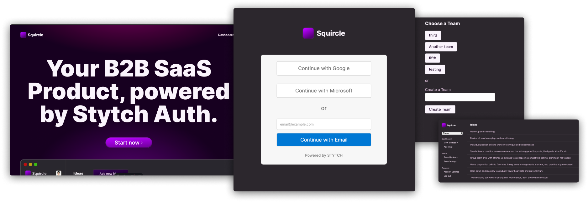

# Stytch B2B App example - Headless

<p align="center">
  
</p>

> 💬 **Note from maintainers**
>
> This application is purely for demonstration and educational purposes. Its setup and configuration resemble typical real-world applications, but it's not a full-fledged production system. Use this app to learn, experiment and tinker with [Stytch][stytch].
>
> Happy Coding!

## Project Structure

This project has two components: a client built as an single-page app (SPA) [React](https://react.dev) app dashboard embedded in an [Astro](https://astro.build) site (source in `client`) and a server built as a [Node](https://nodejs.org) [Express](https://expressjs.com) API (source in `server`). Both live in this repo, and you can run them both at the same time by opening two terminals.

### Client: React SPA + Astro

For an app dashboard, a React SPA is a straightforward way to deliver the client experience. It makes calls to the server API by sending a session cookie, which allows the API to ensure that the current user is authorized to see the data they've requested.

For non-dashboard pages, such as the homepage, the best user experience is to deliver zero JavaScript. For that reason, the marketing side of the client is delivered by Astro, which will ship static files and zero JavaScript by default.

### Server: Node + Express

To handle business logic that requires secret credentials, Node + Express is one of the most common approaches for JavaScript developers. It’s got a great ecosystem and it's deployable anywhere.

## Local Development

For local development, you'll need:

- A Stytch account: https://stytch.com/
- Node >= 20.6.0 (Node 22 is not supported at this time)

### Clone the project

```bash
# clone the repo
gh repo clone stytchauth/stytch-b2b-saas-example

# move into the cloned project
cd stytch-b2b-saas-example/

# install dependencies
cd client/
npm i

cd ../server/
npm i
```

### Create or configure a Stytch B2B project

Before you can run the app, you'll need a [Stytch B2B][stytch-b2b] project.

Note: In development, this app assumes the `test` Stytch environment, which can be set in the top navigation in the [Stytch Dashboard][stytch-dashboard].

If you don't have one already, in the [Stytch Dashboard][stytch-dashboard], click on your existing project name in the top left corner of the Dashboard, click **Create a new project**, and then select **B2B Authentication** or select the project you want to use for this app.

#### Configure Redirect URLs

Configure the following [Redirect URLs](https://stytch.com/docs/b2b/guides/dashboard/redirect-urls) for your project in the [Stytch Dashboard Redirect URLs][stytch-dashboard-redirect-urls] page:

- `http://localhost:3000/authenticate` with **Login, Signup, Invite, Reset Password and Discovery** types.

- `http://localhost:4321/dashboard/login` with **Login** type.

#### Configure Frontend SDK in the Stytch Dashboard

In the [Stytch Dashboard SDK Configuration](https://stytch.com/dashboard/sdk-configuration) the make the following updates:

- Under **Authorized applications** add `http://localhost:4321` as an authorized domain in addition to `http://localhost:3000`.

#### Get your API credentials and store them in the `.env` files

Your API keys will be in your dashboard at this URL:

https://stytch.com/dashboard/api-keys?env=test

Add the project ID, secret, and public token to `server/.env`:

```bash
APP_URL="http://localhost:4321"
STYTCH_PROJECT_ID=""
STYTCH_PUBLIC_TOKEN=""
STYTCH_SECRET=""
```

Next, add the same public token to `client/.env`:

```bash
PUBLIC_API_URL="http://localhost:3000"
PUBLIC_STYTCH_TOKEN=""
```

## Start the client and server

In one terminal, start the server:

```bash
# make sure you're in the server directory
cd server/

# start the app
npm run dev
```

This will start the server at `localhost:3000`.

In a second terminal, start the client:

```bash
# make sure you're in the client directory
cd client/

# start the dev server
npm run dev
```

This will start the client at `localhost:4321`.

From here, you should be able to open the site in your browser, and clicking on the "Dashboard" or "Start now" links will take you to the login page, which will let you register for your app and create an organization.

> **NOTE:** In test mode, you can only use emails matching the domain you signed up with. Trying to use other emails will result in Stytch errors.

[stytch]: https://stytch.com
[stytch-dashboard]: https://stytch.com/dashboard/
[stytch-dashboard-redirect-urls]: https://stytch.com/dashboard/redirect-urls
[stytch-b2b]: https://stytch.com/b2b
[stytch-prebuilt-ui]: https://stytch.com/docs/b2b/guides/ui-components/overview
[b2b-prebuilt-ui-gh]: https://github.com/stytchauth/stytch-b2b-saas-pre-built-ui-example
